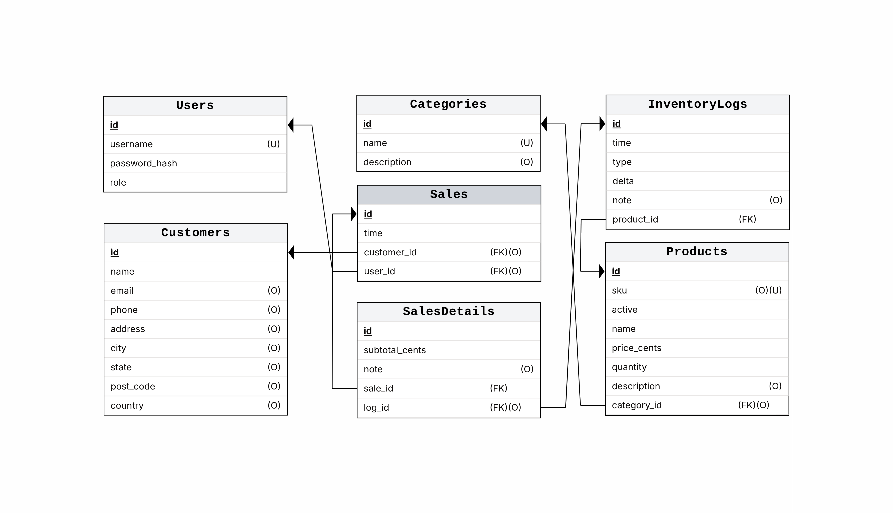

# Logical Diagram and its Derived Schema



The ERD was derived into the corresponding relational structure which is represented by the logical database schema, as shown above. Tables, primary keys, and foreign key relationships that guarantee data consistency and integrity are defined. The schema serves as the basis for the physical database and makes sure that relationships between entities are appropriately maintained by converting the conceptual design into an implementable form.

## Constraints

Some constraints were warranted, in order to preserve the integrity of the database. These were applied provisionally, as cited below in the snippets. One essential thing to be mentioned is that SQLite only checks for foreign key violations when declared separately as explicit constraints. Without repeating explanation, by default, when foreign keys are updated or deleted, they trigger cascading updates as well as reference-deletions (set-null) respectively.

- Constraints for the **Users** table to ensure username uniqueness and role validity

```sql
CREATE TABLE IF NOT EXISTS users (
   ...


   CONSTRAINT username_check UNIQUE (username),
   CONSTRAINT role_check CHECK (role IN ('d', 'r', 'w', 'a'))
   -- `d`eactivated (None), `r`ead (R), `w`rite (CR), `a`dmin (CRUD)
);
```

- Constraint for the **Customers** table to ensure e-mail address validity

```sql
CREATE TABLE IF NOT EXISTS customers (
   ...


   CONSTRAINT email_check CHECK (email LIKE '%_@__%.__%')
);
```

- Constraint for the **Categories** table to ensure name uniqueness

```sql
CREATE TABLE IF NOT EXISTS categories (
   ...


   CONSTRAINT name_check UNIQUE (name)
);
```

- Constraints for the **Products** table to ensure SKU uniqueness,  type correctness[^1], and foreign key update & deletion behaviors to their respective categories

[^1]: Unlike MySQL, SQLite does not have unsigned integer nor boolean types to accommodate for `active_check`, `price_check`, and `quantity_check`. Thus, these constraints must be applied directly.

```sql
CREATE TABLE IF NOT EXISTS products (
   ...


   CONSTRAINT sku_check UNIQUE (sku),
   CONSTRAINT active_check CHECK (active IN (0, 1)),
   CONSTRAINT price_check CHECK (price_cents > 0),
   CONSTRAINT quantity_check CHECK (quantity >= 0),
   CONSTRAINT category_id_check FOREIGN KEY (category_id) REFERENCES categories(id)
       ON UPDATE CASCADE ON DELETE SET NULL
);
```

- Constraints for the **InventoryLogs** table to ensure log type validity, as well as foreign key update & deletion behaviors to their respective products

```sql
CREATE TABLE IF NOT EXISTS inventory_logs (
   ...


   CONSTRAINT type_check CHECK (type IN ('s', 'f', 'r', 'd', 'a', 'o')),
   -- `s`ale, re`f`ill (restock), `r`eturned, `d`amaged, `a`djustment, `o`ther
   CONSTRAINT product_id_check FOREIGN KEY (product_id) REFERENCES products(id)
       ON UPDATE CASCADE ON DELETE SET NULL
);
```

- Constraints for the **Sales** table to ensure foreign key update & deletion behaviors to their respective buying customers as well as logging users

```sql
CREATE TABLE IF NOT EXISTS sales (
   ...


   CONSTRAINT customer_id_check FOREIGN KEY (customer_id) REFERENCES customers(id)
       ON UPDATE CASCADE ON DELETE SET NULL,
   CONSTRAINT user_id_check FOREIGN KEY (user_id) REFERENCES users(id)
       ON UPDATE CASCADE ON DELETE SET NULL
);
```

- Constraints for the **SalesDetails** table to ensure the uniqueness of the referenced **InventoryLogs** entry, as well as foreign key update & deletion behaviors

```sql
CREATE TABLE IF NOT EXISTS sales_details (
   ...


   CONSTRAINT sale_id_check FOREIGN KEY (sale_id) REFERENCES sales(id)
       ON UPDATE CASCADE ON DELETE CASCADE,
   CONSTRAINT log_id_check_unique UNIQUE (log_id),
   CONSTRAINT log_id_check FOREIGN KEY (log_id) REFERENCES inventory_logs(id)
       ON UPDATE CASCADE ON DELETE SET NULL
);
```

## Applying Triggers

SQLite does not precompute, cache, nor maximally optimize queries. Therefore, while it is possible to compute the quantity of a product type by using an aggregate query of all inventory log entries pertaining to the specified product, like exemplified below, this approach is wasteful and nonoptimal, especially as it is an O(n) operation and would have to be called for every product in the user-interface.

```sql
-- A query which may have an O(n × m) time complexity every invocation!
SELECT sku, SUM(delta) AS quantity
FROM products p LEFT JOIN inventory_logs il ON p.id = il.product_id
GROUP BY products.id;
```

Thus, every time an inventory log entry is inserted, deleted, or updated, triggers are relied upon to automatically update the `quantity` attribute of **InventoryLogs**, providing a constant-time access to the product quantities. For the same reason, these triggers are used to set the `total_cents` attribute of the Sales table to the sum of all of its associated **SalesDetails**' `subtotal_cents` attribute, similarly written without any substantial changes.
