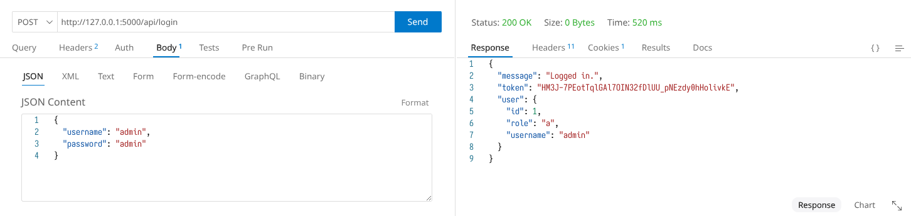
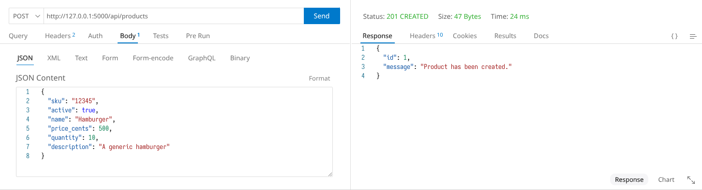
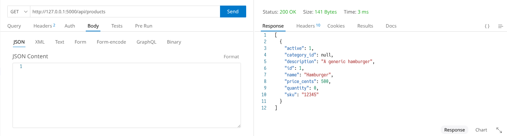
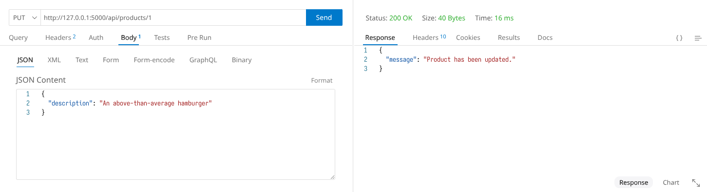
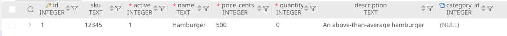
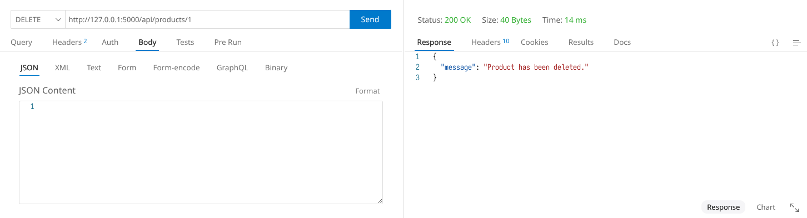
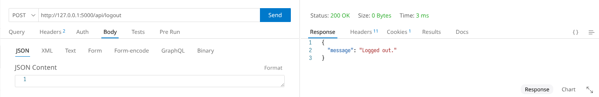

# Backend CRUD Implementation

The backend provides access to the SQLite database over the network, which includes all CRUD operations (**create**, **read**, **update**, and **delete**). The layer, implementing a REST API (exchanging JSONs), especially handles user authentication, permission enforcement, query validation, as well as opaque query calling (interaction with the SQLite library).

## API Documentation

|    **API Route**     | **REST Methods** | **Correspondence**                                     |
| :------------------: | :--------------: | :----------------------------------------------------- |
|       /api/me        |       GET        | Authentication: get current user                       |
|      /api/login      |       POST       | Authentication: log in as a user with password         |
|     /api/logout      |       POST       | Authentication: log out the session                    |
|    /api/products     |    GET, POST     | Everything from the **Products** table                 |
|  /api/products/`id`  | GET, PUT, DELETE | Information of a **Products** entry with the `id`      |
|      /api/users      |    GET, POST     | Everything from the **Users** table                    |
|   /api/users/`id`    | GET, PUT, DELETE | Information of a **Users** entry with the `id`         |
|   /api/categories    |    GET, POST     | Everything from the **Categories** table               |
| /api/categories/`id` | GET, PUT, DELETE | Information of a **Categories** entry with the `id`    |
|    /api/customers    |    GET, POST     | Everything from the **Customers** table                |
| /api/customers/`id`  | GET, PUT, DELETE | Information of a **Customers** entry with the `id`     |
|      /api/sales      |    GET, POST     | Everything from the **Sales** table                    |
|   /api/sales/`id`    |   GET, DELETE    | **SalesDetails** of a **Sales** entry with the `id`    |
|      /api/logs       |    GET, POST     | Everything from the **InventoryLogs** table            |
|    /api/logs/`id`    | GET, PUT, DELETE | Information of a **InventoryLogs** entry with the `id` |

## Demonstrations

### Logging In

By default, the backend creates a default `admin` user with the password `admin`.

Thus, firstly, we log in as the admin with full permissions by using a `POST` request:

### Create (`POST`)

### Read (`GET`)

### Update (`PUT`)

### Delete (`DELETE`)

### Logging Out

